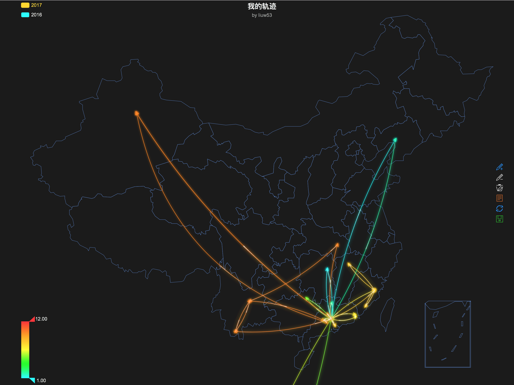

# MyTrace

- A map can describe where I have been. 
- Based on echarts.js, FISH, MySQL and PhalApi.
- See <http://liuw53.com/where>.
- Have fun~

# Frontend

- [FISH](http://fish.ztesoft.com)
- [Echarts.js](http://echarts.baidu.com)

# Api

- [PhalApi](https://www.phalapi.net) + MySQL

# ScreenShot

- Safari

  
 

- Android
  
  <!---->
  
  

